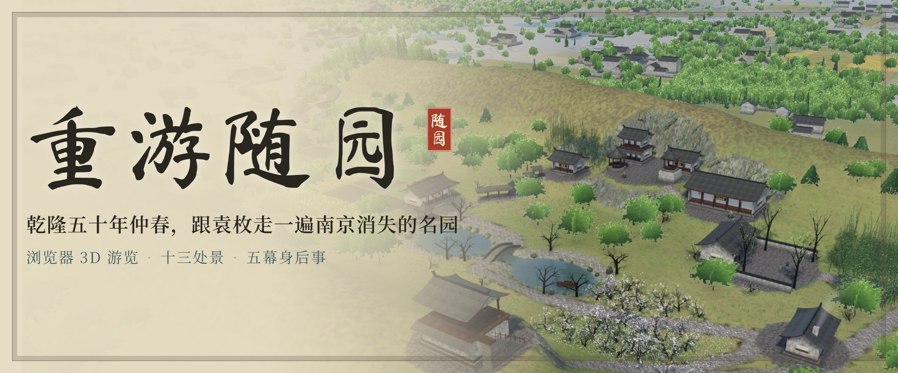
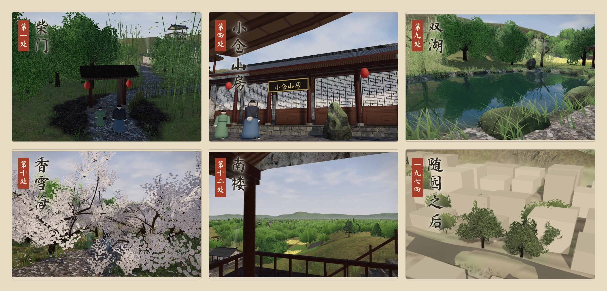

  

  <a href="https://suiyuan.caowenhu.com/"><b>立即入园 · suiyuan.caowenhu.com</b></a> 
  手机、电脑浏览器直接打开 · 无需下载 · 全程约十五分钟

随园是袁枚在南京小仓山住了将近五十年的园子。他死后五十多年，园子毁于太平天国战火，如今一块砖也找不到了。

《重游随园》在浏览器里把它搭了回来：乾隆五十年（1785）仲春，你是袁枚的一位远方旧友，他领你从清晨走到天黑，用他自己的诗文讲这座园子。

  

## 每句话都有来历

对白下方都标着出处，分五类。具体出处写在网页里的「注解」中。

| 标签 | 含义 |
| --- | --- |
| 文载 | 袁枚本人诗文原句 |
| 图记 | 袁起《随园图》（1865）及《随园图记》 |
| 传述 | 后世记载、方志与研究者转述 |
| 推测 | 依清中期江南园林做法类推 |
| 虚构 | 为游览编写的情节与对白 |

## 一条游线

柴门 → 竹径 → 大院·四桐 → 小仓山房 → 书仓 → 小眠斋 → 藤花廊 → 诗世界 → 双湖·渡鹤桥 → 香雪海 → 厨下 → 南楼 → 暮别

天色随游线从清晨走到入夜。走完之后，还有五幕「随园之后」：嘉庆二年（1797）· 咸丰三年（1853）· 同治四年（1865）· 民国 · 1974。

电脑上拖动旋转、滚轮缩放、空格继续；手机上单指拖动、双指缩放、轻点继续。

## 怎么做的

- 单个网页，基于 three.js。树、竹、草和野花按规则程序生长，建筑用实拍 PBR 材质。
- 双湖有实时倒影和水底光斑。一日天色连续变化，黄昏时窗纸透光。
- 远处的钟山、鸡鸣寺、后湖、长干塔、雨花台按真实方位摆放。
- 古琴、箫与园中环境声都是程序实时合成，不含音频文件。
- 画面是依据诗文与图记的写实复原，**园林布局为示意，不是测绘**。
- 需要支持 WebGL 2 的浏览器。帧率不够时会自动降低分辨率，普通核显也能跑完全程。

<b>本地预览与维护</b>（给作者和接手的人）

### 预览

在项目根目录运行 `python -m http.server 8000`，打开 http://localhost:8000/suiyuan.html 。直接双击 html 读不到 `tex/` 贴图。这个版本从 jsdelivr 和 Google Fonts 加载 three.js 与字体。

### 修改与构建

1. 改 `src/`、`src2/` 下的源码。
2. `python build2.py` → 生成 `suiyuan.html`。

### 打包与部署

1. 第一次先 `npm ci`，按 `package-lock.json` 装好锁定版本的 three.js 和字体。
2. `python tools/make_site.py` → 生成 `site/`（可用 `python -m http.server -d site` 预览）和 `site.zip`。
   - 网站包自托管 three.js 与字体，只带页面用到的字所在的分片，并附 `THIRD-PARTY-NOTICES.txt`。
   - 脚本自带删除保护：输出目录只能在项目内，且必须是上次生成的网站目录。
3. 进入 EdgeOne Pages 控制台，打开项目 `suiyuan` → 构建部署 → 新建部署：
   1. 先选「预览」，上传 `site.zip`，用预览链接检查（链接 3 小时内有效）。
   2. 没问题再新建一次部署，选「生产」，上传同一个 zip。
   - zip 根目录必须直接是 `index.html`。
   - 平台只保留最近 3 次部署。回滚在部署记录里点「重新部署」；更早的版本用 Release 里的网站包重新上传。

改 README 配图：`npm ci` 之后运行 `python tools/render_readme.py`，按 `assets/readme/source/` 里的版式重新导出三张图。

### 运维信息

| 项 | 值 |
| --- | --- |
| 网址 | https://suiyuan.caowenhu.com/ （公众号文章与二维码都指向它，**网址不能改**） |
| 域名 | caowenhu.com，阿里云注册，2029-03-23 到期，**别让它过期** |
| 解析 | CNAME `suiyuan` → `suiyuan.caowenhu.com.pages.dnsoe5.com` |
| 托管 | 腾讯云 EdgeOne Pages，项目 `suiyuan`，免费 HTTPS 证书 |
| 备案 | 苏ICP备2024089758号-1 |

### 大文件

短片、网站包 zip、配音草稿（`audio/`）不进仓库，只在作者本地。线上网站包和 58 秒短片另存在 GitHub Release。

`git clean -x` 会删掉这些被忽略的文件，**不要用**。

### 目录

| 路径 | 内容 |
| --- | --- |
| `suiyuan.html` | 构建好的单页网页（需与 `tex/` 放在一起） |
| `tex/` | 实拍材质贴图（Poly Haven，CC0），39 张 webp |
| `src/data.js` | 剧本、注解、史料出处、尾声时间轴、地标 |
| `src/audio.js` | 程序合成的古琴、箫、环境声，以及配音播放（配音已关闭） |
| `src2/core.js` | 渲染核心：共享天色、雾、风、接地暗影、水底光斑 |
| `src2/mats.js` | 贴图加载、程序绘制的叶片花卉、建筑材质 |
| `src2/base.js` · `builders.js` · `garden.js` · `merge.js` | 地形函数、游线、厅堂亭楼廊桥、园林布置、建筑合并 |
| `src2/flora.js` · `plant.js` | 程序生长的树、竹、草、野花及园中栽植 |
| `src2/ground.js` | 园中地形、园外远地、池水倒影、江湖 |
| `src2/far.js` | 天空、远山林木、城中屋宇、大报恩寺塔 |
| `src2/figures.js` · `assemble.js` · `app.js` · `shell.html` | 人物、渲染装配与一日天色、导览逻辑、页面骨架 |
| `build2.py` | 构建 `suiyuan.html` |
| `tools/make_site.py` | 生成自托管的部署包 `site/` 与 `site.zip` |
| `tools/render_readme.py` | 导出 README 配图 |
| `tools/make_qr.py` | 生成二维码与卡片（当初在 Claude 云端运行，路径写死；二维码已定稿，无需重跑） |
| `tools/` 其余脚本 | 导出朗诵稿、配音清单 |
| `site_assets/` | 网站图标与分享图（与线上一致） |
| `archive/v3/` | v3 发布版页面与源码备份 |
| `docs/朗诵稿.md` | 真人朗诵稿本地备份 |
| `docs/配音稿/` | 按角色拆分的配音稿与清单（配音已放弃，留档） |
| `公众号/` | 公众号推广文章的文稿、插图、封面、二维码与交接说明 |
| `assets/readme/` | README 配图及其版式源文件 |

作者本人可见的在线文档：[朗诵稿](https://claude.ai/artifact/DLHq4xVMseXkStXsg8VivA)、Claude 文档「公众号定稿 · 重游随园」。

### 当前状态

- 定为无声版：配音关闭（`src2/app.js` 中 `VOICE_ENABLED = false`），配音稿保留在 `docs/配音稿/`。
- 完整长视频（逐帧导出）暂缓。2026-09-26 那条 633MB 的实时录屏已不在本地。
- 每次改动后，在下面的「更新记录」里加一行。

### 更新记录

- 2026-09-25 v3：工笔化美术、建筑补底与屋檐厚度、南楼石阶与上下楼步态；撤下合成配音；新增真人朗诵稿。
- 2026-09-26 v4：美术写实重构——three.js 升级到 0.170，实拍 PBR 材质，程序生长的树木竹林与草丛，双湖实时倒影、透明池水与水底光斑，天空云层与远处钟山、玄武湖、长江、城中屋宇；黄昏窗纸透光；尾声新增“白模”阶段。v3 备份在 archive/v3/。
- 2026-09-26 v4.1：流畅度（帧率不够时自动降分辨率、预编译着色器、环境光少重算、阴影贴图减半）；人物不再穿石头和门板；远景按实际方位与视角大小重建（钟山、清凉山、鸡鸣寺黄墙、后湖、莫愁湖与胜棋楼、长干塔、雨花台、城中屋宇），远处的树改为画出的树冠；尾声建筑逐渐散去、民国楼房正常显示；新增袁枚墓（百步坡）与袁家祠堂；南楼台词两处方位措辞随实测方位修订。
- 2026-09-26：新增 docs/配音稿/，按旁白、袁枚、书童、访客拆分，朗读文本已把数字改成汉字读法。
- 2026-09-26 v4.2：定为无声版。对白改为逐字显现（按朗读节奏停顿，文言更慢），文言原句与白话解释合成一张卡；到每一处时左侧浮现竖排景名；人物说话时点头、比划；对话时镜头轻微左右呼吸；自动播放默认开启。配音稿保留在 docs/配音稿/，以后有合适的录音仍可接入。
- 2026-09-26 v4.3：在本机（Intel 核显）实测后做性能优化——园外树木远近分级（近处长成的树、远处画出的树冠，绘制次数不增加）、雾和空气透视改为按顶点计算、阴影隔帧更新并改用较轻的过滤、环境光只在到站时重算、草量和倒影分辨率下调、电脑端清晰度上限 1.5 倍；尾声线稿预先编译，避免第一幕卡顿；建筑脚下暗影减弱。
- 2026-09-26 v4.4：厨下石板闪烁修复（阶条石与台面不再重合）；人物加五官、说话时嘴动；池水更清不发灰；手机顶栏并成一行；新增影片模式（?film 自动问答、藏顶栏鼠标；?film=rec 页内录制）；新增 tools/make_site.py（自托管 three.js 与字体的部署包）、make_qr.py；公众号素材放在 公众号/。
- 2026-09-27：网站上线 https://suiyuan.caowenhu.com/（腾讯云 EdgeOne Pages 项目 suiyuan，阿里云解析 CNAME→suiyuan.caowenhu.com.pages.dnsoe5.com，免费 HTTPS 证书）；公众号插图 6 张放在 公众号/插图/，定稿在 Claude 文档「公众号定稿 · 重游随园」。
- 2026-09-27 v4.5：手机（含微信内置浏览器）开场卡片不再被顶部遮住——标题改横排、卡片可滚动、手机上隐藏电脑操作说明、禁止微信放大字号；开场介绍改为"1748 年买下园子，次年辞官"。
- 2026-09-27：公众号推广文章已发表（能文能虎），含 58 秒短片与二维码；发布素材整理在 公众号/发布包/（视频以 suiyuan_short.mp4 为准，去掉了开头黑场）。
- 2026-09-29：整理成 GitHub 仓库 mckf111/suiyuan——锁定依赖版本，构建与打包脚本可在本机运行（重建的网站包与线上 v4.5 逐字节一致），打包加删除保护并附第三方许可声明；移除 v3 遗留文件；新增 LICENSE.md 与 README 配图。
- 2026-09-29 v4.6：开场画面底部居中挂备案号（苏ICP备2024089758号-1，链接工信部备案系统），进园后随开场卡片隐藏；修复横屏矮屏上开场卡片顶部被裁（限高改为按视口计算、含内边距）；网站包附 THIRD-PARTY-NOTICES.txt。

  

## 版权

© 2026 曹文虎。**保留所有权利**：源码公开供查看，不授权复制、改编或再发布。欢迎个人非商业的截图、录屏分享，请注明《重游随园》与网址。详见 [LICENSE.md](LICENSE.md)。

three.js（MIT）、马善政楷书 / 站酷小薇 / Noto Serif SC（SIL OFL 1.1）、Poly Haven 材质贴图（CC0）按各自许可使用。袁枚诗文与袁起《随园图》属于公有领域。

这个作品从头到尾只用了一个 AI：Claude Opus 5.5。
