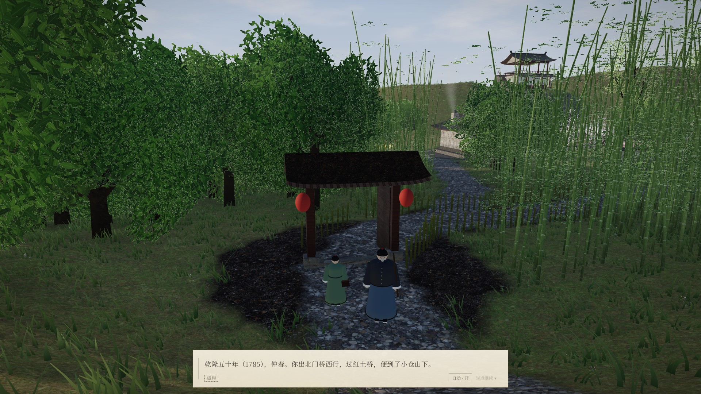
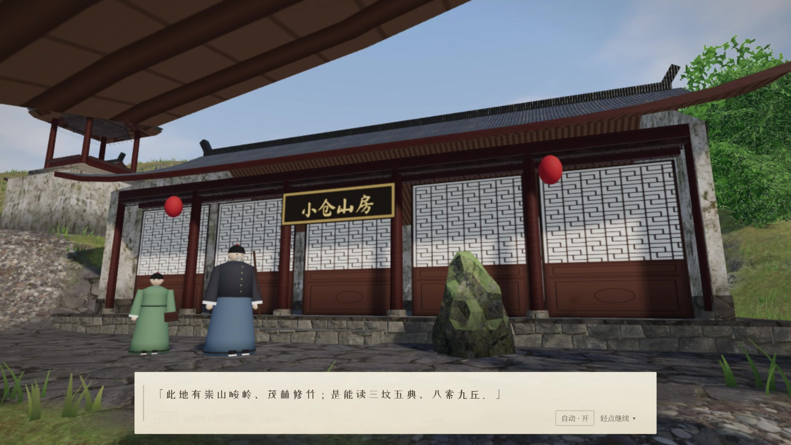
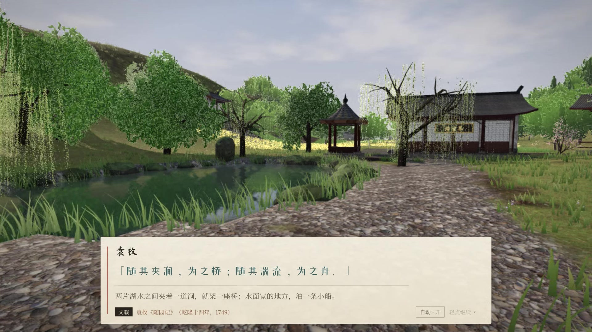
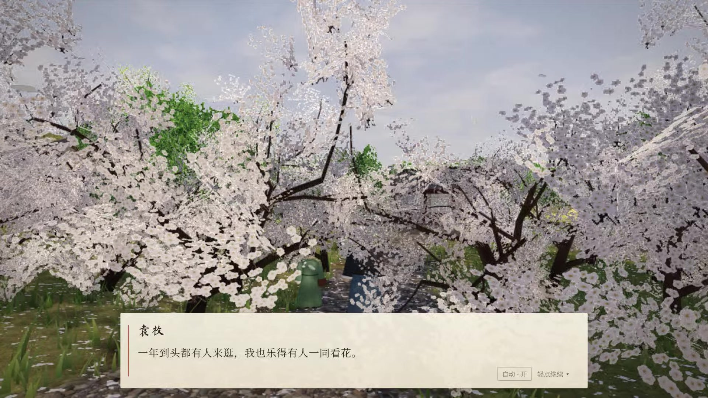
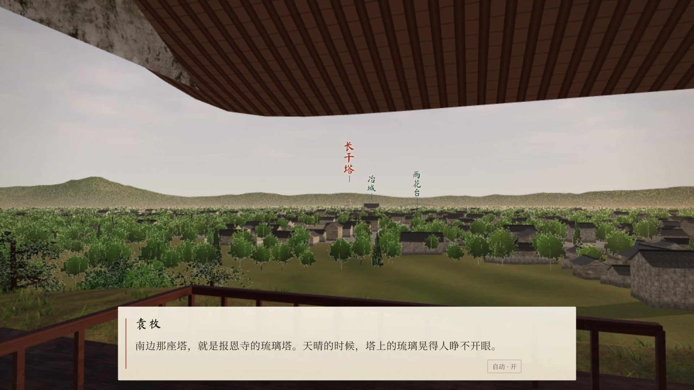
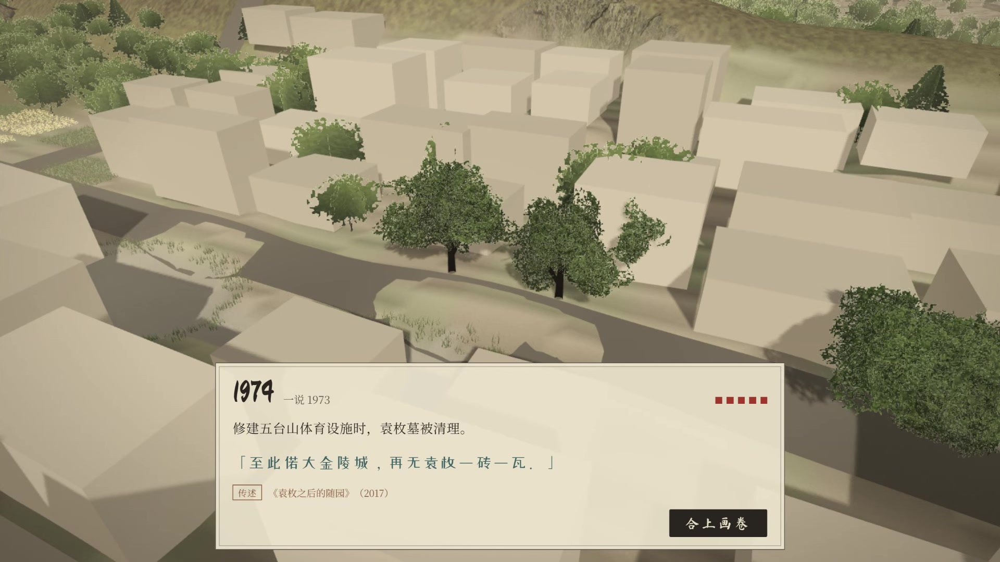

# 南京百余年前消失了一座园子，我请袁枚本人带你再逛一圈｜随园 3D 虚拟游览

袁枚，浙江钱塘人，乾隆年间的大才子。三十出头辞了江宁知县不做，在南京小仓山下买了一座荒园，改名随园，一住就是近五十年。写诗，收徒，会客，还写了一本至今有人照着做菜的《随园食单》。

嘉庆二年（1797 年），袁枚在随园病逝，八十二岁。

临终前他交代儿子：园子照旧洒扫，东西照旧摆好，让客人来了，还以为他人在。如此撑持三十年。

袁家守了六十多年，比他要的多了一倍。

然后是咸丰三年（1853 年），太平军进了南京。二百多亩的随园被平成了田，亭台楼阁一件不剩。三年后（1856 年），他在南楼上望了半辈子的报恩寺琉璃塔，也毁了。

再往后，这里盖了大学，修了马路。1974年前后，五台山修体育设施，袁枚的墓也被清掉了。

有人写过一句：至此偌大金陵城，再无袁枚一砖一瓦。

我住在南京。随园旧址就在广州路、五台山一带，今天走过去，是马路、校园和体育馆。

这回，我让 AI 帮我把它搭了回来。

### 一个有点突然的念头

前两天 Claude Opus 5.5 发布，网上不少人拿它做出各式各样漂亮的东西，我也手痒。

住在南京，做大家熟悉的地方，拍的人太多，做出来容易俗。那做一个已经不在的呢？借 AI 把它复原出来，让人走进去——嘿，好像有点意思。

做哪一个，是我和 AI 商量着定的。它给了几个候选，随园排在前头：有名，有人，有故事，还彻底没了。

于是有了《重游随园》。

> 【视频】此处插入 `01_视频_短片.mp4`（公众号后台手动上传）

一个网页，免费，不用下载，手机电脑点开就能逛。想先进去看看，长按下面的二维码就行。

### 乾隆五十年（1785 年），仲春

进去以后，你便化身为袁枚的一位远方旧友。

那一年，袁枚七十岁，辞官三十多年，随园正热闹。你出北门桥往西，过红土桥，到小仓山下。柴门朝北，没有围墙。书童跑进去喊一声「先生，客人到了」，他就拄着拐杖迎出来。

他领你走十三处，从清早走到天黑。每到一处，讲这里是做什么的，时不时念一句自己当年写下的原文。你可以接着问他，也可以不问，继续走。

问他这园子为什么叫随园。他说原是织造隋公的园子，他拿三百两俸银买下来，字音没改，只换了个意思：高处起楼，低处筑亭，一切随它。

问他为什么不修围墙。他只回一句：园子好看，总该让人看见。

一路上还有书仓、藤花廊、诗世界。双湖的水是清的，岸边看得见底；香雪海是一片梅林，仲春正开。

### 南楼上

整趟走下来，我最喜欢的是南楼。

登上楼，东边是钟山，南边是报恩寺的琉璃塔，西边是清凉山和莫愁湖。这些都按真实的方位和远近摆放好。袁枚当年站在这里看到的，大致就是这个样子。

塔还在，山还在，楼下的园子也还在。可后来的我们都知道，七十年后塔就没了，塔没之前三年，园子先没了。

这是做的过程中，最打动我的一幕。

### 天黑之后

天黑了，袁枚和你道别。游览到这里并没有结束。

镜头升起来，园子先褪成一座白模，再一点点散掉。嘉庆二年（1797）、咸丰三年（1853）、同治四年（1865）、民国（1923），一直到一九七四年。两百多年，几十秒走完。

开头那句「再无袁枚一砖一瓦」，你会亲眼看着它发生。

### 哪句是真的

随园没有留下测绘图。能依据的，是袁枚自己的《随园记》和诗文，还有他的族孙袁起在园子毁掉十二年后，凭记忆画的《随园图》。

所以它不是严格的复原。很多房子长什么样，是按清中期江南园林的做法推出来的。

为此每一句对白都标了来历：文载、图记、传述、推测、虚构。哪句是袁枚真说过的，哪句是我替他说的，点开「注解」都能看到出处。

袁枚长什么样，也没人说得清。他自己就嫌罗聘给他画的小像不像，题了一段该谐的长跋寄回去。所以园里的他，只是一个穿长袍、拄拐杖的老先生。

懂行的朋友如果发现哪里考据不对，请留言告诉我，我让小克去改。

### 关于 AI

最后说几嘴。

这个作品从头到尾只用了一个 AI：Claude Opus 5.5。程序、三维场景、对白和出处整理，大部分是它做的；走哪几处、说什么话、画面往哪改，是我一遍遍走过之后定的。

就连随园这个选题，也是它帮我挑的。

贴图用的是 Poly Haven 的公开材质，字体是开源字体。

### 入园

长按识别二维码，或者点文末「阅读原文」，就能进园。走一遍十几分钟，电脑上效果最好，手机也行。

身边有南京朋友的，转给他们看看。说不定他们天天路过的地方，两百多年前，就是这座园子。
